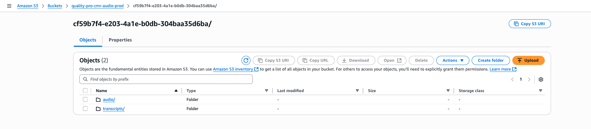
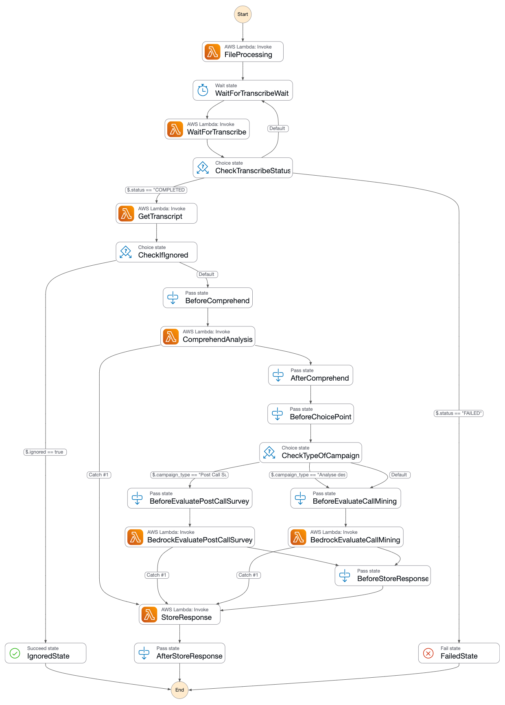

# Quality Pro - Call Center Analytics

## Overview

Quality Pro is a serverless application that helps companies in Cameroon analyze their call center conversations. Today, most companies listen to less than 1% of calls, and the process is slow and manual. With Quality Pro, you can automatically analyze all your calls, get useful insights, and improve agent performance without extra effort.

## Problem Statement

Traditional call quality monitoring in telecommunications companies involves:

- Manual listening to a tiny fraction of calls (<1%)
- Time-consuming evaluation processes
- Limited insights into customer interactions
- Inability to scale quality monitoring

## Solution

Quality Pro leverages AWS AI services to automatically analyze two critical aspects of call center operations:

### Entry Call Analytics
Analysis of live customer conversations (inbound/outbound calls):
- Agent performance evaluation with detailed scoring (CSAT, NPS)
- Conversation quality metrics (clarity, duration, courtesy)
- Sentiment analysis and detection of customer frustration points
- Actionable recommendations for agent improvement

### Post-Call Survey Analysis
Evaluation of customer feedback after interactions:
- Automatic survey result processing and scoring
- Customer satisfaction measurement and churn probability
- Identification of recurring issues and improvement areas
- Alert system for critical customer concerns

All powered by a serverless infrastructure leveraging Amazon Bedrock for comprehensive AI-driven insights.

## Key Features

- Audio file processing and transcription
- AI-powered conversation analysis
- Campaign management
- Entry and post-call survey analyses
- Campaign performance evaluation
- Automated reporting and CSV export

## Dashboard & Analytics

Quality Pro provides comprehensive campaign dashboards with key performance indicators:

### Campaign Performance Metrics
- **Net Promoter Score (NPS)**: Track customer loyalty and satisfaction
- **Customer Satisfaction (CSAT)**: Measure service quality scores
- **Call Resolution Rate**: Monitor first-call resolution percentages
- **Average Response Quality**: Evaluate agent response relevance
- **Churn Risk Analysis**: Identify customers at risk of leaving

### Conversation Quality Indicators
- **Call Duration Analysis**: Highlight abnormally long calls (87.9% in sample data)
- **Courtesy Score**: Measure agent politeness and professionalism 
- **Information Repetition**: Detect redundant information in conversations
- **Sentiment Distribution**: Visualize emotional tone of customer interactions

### Actionable Insights
- **Improvement Priority Areas**: AI-generated recommendations for agent training
- **Recurring Actions**: Identification of common agent behaviors
- **Problem Resolution Tracking**: Monitor issue resolution status across campaigns

All metrics are presented in intuitive charts and graphs for easy interpretation and decision-making.

## Technical Architecture

The application is built on a fully serverless architecture:

### Backend Infrastructure

- **CloudFormation**: Infrastructure as code for all AWS resources
- **AWS Lambda**: Serverless functions for all API endpoints
- **Amazon DynamoDB**: NoSQL database for storing all analytical data
- **Amazon S3**: Storage for audio files and transcriptions
- **AWS Step Functions**: Orchestration of the analysis workflow
- **Amazon SQS**: Messaging queue for processing audio files

### AI/ML Components

- **Amazon Transcribe**: Speech-to-text conversion
- **Amazon Comprehend**: Sentiment analysis and entity extraction
- **Amazon Bedrock**: Advanced conversation analysis and evaluation based on Claude Haiku

### Web Application Layer
- **NextJs**
- **AWS Cognito**

### API Layer

- **AWS SAM**: Serverless Application Model for API development
- **API Gateway**: RESTful API endpoints

## Call Analysis Workflow

The Quality Pro application features a modern serverless audio analysis workflow that leverages AWS Step Functions to orchestrate a series of Lambda functions. Here's how the process works:

### Audio Processing Pipeline

1. **Campaign Creation & File Upload**:
    - From the web application, the user first creates a campaign to group all related analyses.
    - When a campaign is created, a dedicated folder is initialized in the S3 bucket (`AudioBucket`).
    - This folder will contain all audio files and transcripts used for the analyses of that campaign.
    
    - When an audio file is uploaded to this campaign folder, it triggers a notification.
    - The S3 event notification is filtered to only process `.mp3` files
    - The notification is sent to an SQS queue (`FileProcessingQueue`) configured with appropriate permissions
2. **Workflow Initiation**:
    - The `StepFunctionTriggerFunction` Lambda is configured with an SQS event source mapping
    - When a message arrives in the queue, this function:
        - Extracts metadata from the message
        - Creates an entry in DynamoDB to track the processing status
        - Initiates the Step Functions state machine
3. **Orchestrated Processing with Step Functions**: The state machine orchestrates the following steps:
  - a. **File Processing** (`FileProcessingFunction`):
    - Initiates an Amazon Transcribe job for the audio file
    - Updates the status in DynamoDB

  - b. **Transcribe Monitoring**:
    - `WaitForTranscribeWait`: Pauses execution for 30 seconds
    - `WaitForTranscribeFunction`: Checks if the Transcribe job is complete
    - `CheckTranscribeStatus`: A choice state that:
        - Continues to the next step if transcription is complete
        - Returns to wait state if still in progress
        - Moves to failure state if transcription failed
 - c. **Transcript Processing** (`GetTranscriptFunction`):
    - Retrieves the completed transcript from S3
    - Performs initial formatting and preprocessing
    - Determines if the file should be ignored based on content
 - d. **Sentiment Analysis** (`ComprehendFunction`):
    - Analyzes the transcript using Amazon Comprehend
    - Extracts sentiment, key phrases, and entities
    - Enriches the data payload with these insights
 - e. **Campaign-Type Specific Analysis**:
    - `CheckTypeOfCampaign`: Routes to appropriate analysis path
    - For call mining (inbound/outbound calls): `BedrockEvaluateCallMining`
    - For post-call surveys: `BedrockEvaluatePostCallSurvey`
 - f. **AI-Powered Analysis with Amazon Bedrock**:
    - `BedrockEvaluateFunction`: Analyzes call content using Claude Haiku
    - Evaluates conversation quality, agent performance, customer issues
    - For surveys: `BedrockEvaluatePostCallSurveyFunction` analyzes customer feedback
 - g. **Results Storage** (`StoreResponseFunction`):
    - Stores all analysis results in DynamoDB
    - Updates the status to complete
    - Makes data available for frontend queries

#### Call Analysis Workflow Diagram



### Error Handling and Monitoring

- Comprehensive error handling at each stage with catch blocks
- Dead Letter Queue (`FileProcessingDLQ`) for processing failed messages
- Execution monitoring with timestamps at key stages
- Automatic retry logic for transient failures

### Key Advantages

This serverless workflow offers several benefits:

- **Highly scalable**: processes thousands of calls concurrently
- **Cost-effective**: pays only for actual processing time
- **Well-monitored**: traces execution flow for troubleshooting
- **Resilient**: includes retry mechanisms and error handling
- **Event-driven**: eliminates the need for continuous polling
- **Integration**: Seamlessly connects with S3, SQS, Step Functions, DynamoDB, and AI services.

The architecture demonstrates a production-grade serverless implementation that combines multiple AWS services to create a sophisticated AI-powered call analysis system.

## AWS Services Used

- **AWS Lambda**: Serverless compute for all backend logic
- **Amazon S3**: Storage for audio files and transcripts
- **Amazon SQS**: Queue for decoupling file uploads and processing
- **AWS Step Functions**: Orchestration of the audio analysis workflow
- **Amazon DynamoDB**: NoSQL database for storing analysis results
- **Amazon Transcribe**: Speech-to-text transcription
- **Amazon Comprehend**: Sentiment and entity analysis
- **Amazon Bedrock**: Advanced AI-powered conversation analysis
- **AWS CloudFormation**: Infrastructure as code
- **AWS SAM**: Simplified serverless application deployment

## Business Opportunity 💡

Initially developed to address telecommunications call center needs in Cameroon, Quality Pro has been identified as a potential SaaS solution for:

- Telecommunications companies
- Local banks (already expressed interest)
- Insurance companies

## Future Development

1. Integration with Bedrock knowledge bases to provide context-aware analysis
2. Implementation of customizable evaluation grids for different business needs
3. Expansion to other industries beyond telecommunications
4. Development of real-time analytics capabilities

## Why is this project special?

### Innovation & Impact

- **Real-World Problem Solving:** Quality Pro addresses a critical pain point in the telecommunications industry in Cameroon, manual call quality assessment that is slow, costly, and covers less than 1% of calls. By automating this process, the solution brings immediate, measurable value to businesses and their customers.
- **AI-Powered Insights:** Leveraging Amazon Bedrock, Comprehend, and Transcribe, the platform delivers advanced analytics, sentiment detection, and actionable feedback beyond simple transcription.
- **Scalable & Serverless:** The entire backend is built on AWS Lambda, Step Functions, S3, SQS, and DynamoDB, ensuring scalability, resilience, and cost-efficiency. The architecture is production-grade and ready for SaaS deployment.

### Technical Excellence

- **Event-Driven Workflow:** From S3 upload to SQS queue to Step Functions orchestration, every step is automated and monitored, demonstrating best practices in serverless design.
- **Modular & Extensible:** The infrastructure is defined as code (CloudFormation/SAM), making it easy to extend, replicate, or adapt for other industries (e.g., banking, insurance).
- **Security & Compliance:** Fine-grained IAM roles and policies ensure that each Lambda function has only the permissions it needs, following the principle of least privilege.

### Business Potential

- **Market Validation:** Initial feedback from local banks and telecoms confirms strong interest and real demand for the solution.
- **Future Roadmap:** Plans include knowledge base integration, customizable evaluation grids, and real-time analytics ensuring ongoing innovation.

### Hackathon Alignment

- **Built for AWS Lambda:** Every core process leverages Lambda’s strengths scalability, event-driven execution, and seamless integration with other AWS services.


## Deployment & Testing

### Prerequisites

Before deploying, ensure you have:

- AWS CLI installed and configured with appropriate permissions
- AWS SAM CLI installed
- Bash shell (Linux/macOS/WSL)
- Access to an AWS account with permissions for Lambda, S3, DynamoDB, Step Functions, SQS, Bedrock and Haiku etc.

### Quick Start Deployment

The project includes an automated deployment script that sets up the entire infrastructure:

```bash
# Clone the repository
git clone https://github.com/isma237/quality-pro-hackathon.git
cd quality-pro

# Make the deployment script executable
chmod +x deploy.sh

# Run the deployment (creates unique resources with timestamps)
./deploy.sh
```

### What the Deployment Script Does

The `deploy.sh` script automatically:

1. **Creates unique resource names** with timestamps to avoid conflicts
2. **Sets up a temporary S3 bucket** for deployment artifacts
3. **Packages and uploads Lambda functions** to S3
4. **Deploys the CloudFormation stack** with all AWS infrastructure:
   - Lambda functions for audio processing and AI analysis
   - Step Functions workflow for orchestration
   - DynamoDB table for storing results
   - S3 bucket for audio files and transcripts
   - SQS queues for reliable message processing
5. **Deploys the SAM backend API** with all REST endpoints
6. **Displays deployment outputs** with resource names and URLs

### Deployment Output Example

After successful deployment, you'll see output similar to:

```bash
=== Deployment Information ===
CloudFormation Stack: quality-pro-stack-isma-dev-12345
SAM Stack: quality-pro-backend-isma-dev-12345
S3 Bucket: quality-pro-audio-isma-dev-12345
DynamoDB Table: CampaignsTable-isma-dev-12345
State Machine: file-processing-statemachine-isma-dev-12345
```

### Testing with the Web Application

The project includes a complete web application already deployed and connected to API Gateway for end-to-end testing.

#### **Access the Live Web Application**

🌐 **Application URL**: https://quality-pro-ai.rgotn1ka5iccm.us-west-2.cs.amazonlightsail.com/

#### **Test Credentials**

Use the following credentials to log into the application:

**Test Account:**
- **Email**: `test@qualitypro.ai`
- **Password**: `QualityPro2025!`


#### **End-to-End Testing Workflow**

Once logged in, follow this complete testing workflow:

1. **Explore Existing Campaigns**
   - Navigate to "Campagnes d'analyses audio"
   - Review pre-loaded campaigns like "CSAT#Juin2025" and "SuperTestA"
   - Click "Consulter la campagne" to view detailed analytics

2. **Review Sample Analytics**
   - Check campaign dashboards with real metrics:
     - Call resolution rates (18.2% in sample data)
     - Quality scores (3.3/10 average)
     - Customer satisfaction distribution
     - Agent performance indicators
   - Explore individual call analysis with AI insights

3. **Create Your Own Campaign**
   - Click "Créer une nouvelle campagne"
   - Choose campaign type:
     - **"Analyse des Appels Entrants"** for call center conversations
     - **"Post Call Survey"** for customer feedback analysis
   - Fill campaign details:

4. **Upload Test Audio Files**
   
   Use the provided sample files from the `test_data` folder:

## Contributors

- Ismael Gadji 🇨🇲 - Lead Developer and Technical Trainer in Cameroon